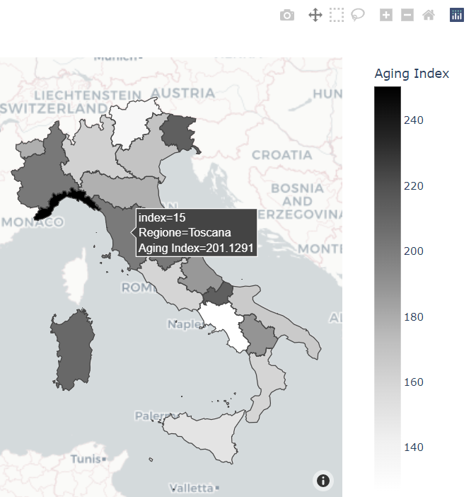

# 30DayMapChallenge_2021
Repository for #30DayMapChallenge - 2021

## Day 1 of #30DayMapChallenge 2021 - Points

## Day 2 of #30DayMapChallenge 2021 - Lines

## Day 3 of #30DayMapChallenge 2021 - Polygons

## Day 4 of #30DayMapChallenge 2021 - Hexagons

## Day 5 of #30DayMapChallenge 2021 - OpenStreetMap

## Day 6 of #30DayMapChallenge 2021 - Red

## Day 7 of #30DayMapChallenge 2021 - Green

## Day 8 of #30DayMapChallenge 2021 - Blue

## Day 9 of #30DayMapChallenge 2021 - Monochrome

## Day 10 of #30DayMapChallenge 2021 - Raster

## Day 11 of #30DayMapChallenge 2021 - 3D

## Day 12 of #30DayMapChallenge 2021 - Population

## Day 13 of #30DayMapChallenge 2021 - Natural Earth

## Day 14 of #30DayMapChallenge 2021 - Map with a new tool

## Day 15 of #30DayMapChallenge 2021 - Map made without using a computer

## Day 17 of #30DayMapChallenge 2021 - Land

## Day 21 of #30DayMapChallenge 2021 - Elevation

## Day 26 of #30DayMapChallenge 2021 - Choropleth
